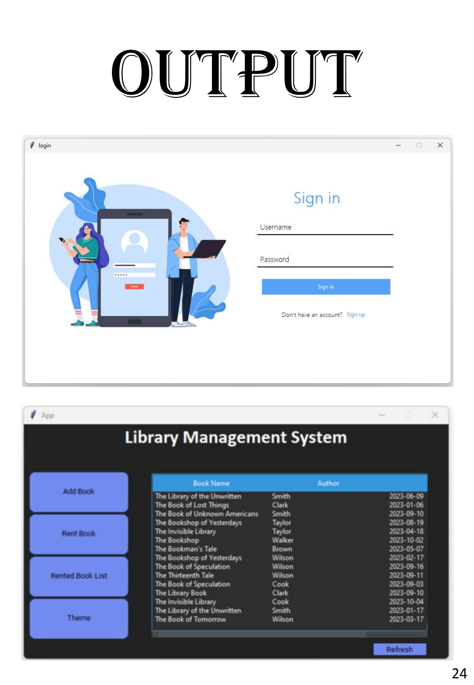
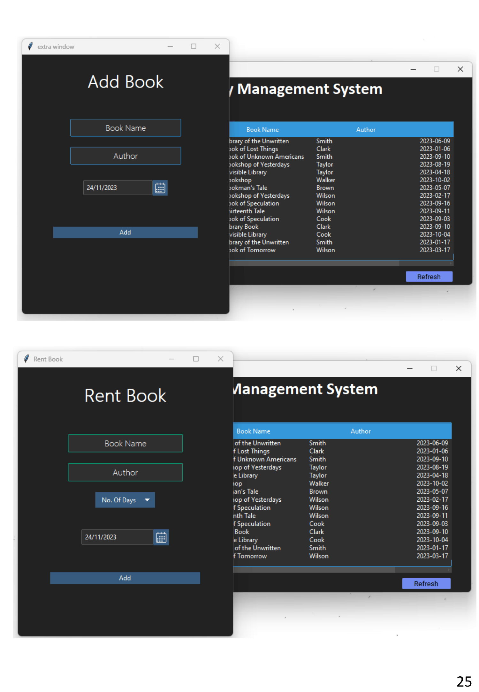
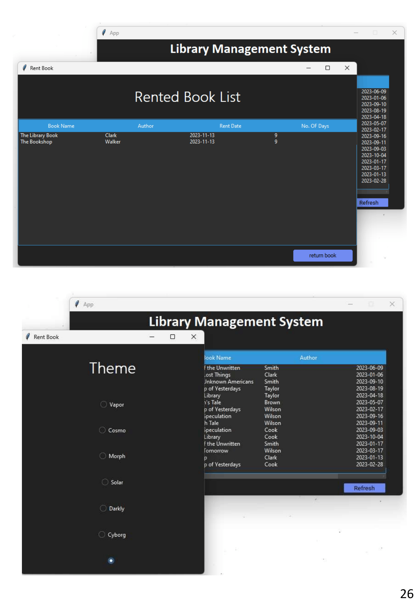

# Library Management System

A desktop-based Library Management System built with Python, Tkinter, and MySQL. Developed as a Class 12 project.

## Features

- Add books to the library inventory
- Rent books and track rental duration
- View all currently rented books
- Return rented books back to inventory
- Theme switcher (vapor, cosmo, morph, solar, darkly, cyborg)

## Tech Stack

- **Python** — core language
- **Tkinter + ttkbootstrap + customtkinter** — GUI
- **MySQL** — database

## Requirements

- Python 3.x
- MySQL installed and running locally
- Required Python libraries:
```
pip install mysql-connector-python ttkbootstrap customtkinter
```

## Setup & Run

1. Clone the repo
2. Open `library_management_system.py` and update the DB config at the top:
```python
HOST = 'localhost'
USER = 'root'
PASSWORD = 'your_password'
DATABASE = 'library_management_system'
```
3. Place `login.png` in the same folder as the script
4. Run the script:
```
python library_management_system.py
```
The database and tables are created automatically on first run.

## Login

| Field    | Value   |
|----------|---------|
| Username | admin   |
| Password | 123     |


## Screenshots



